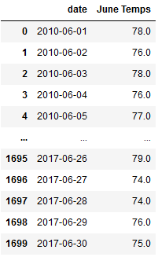
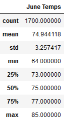
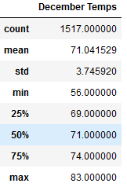
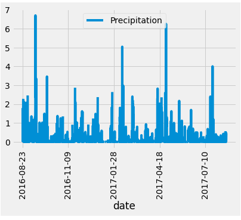

# surfs_up

## Background

### Investing in Waves and Cream. 
To provide investor support to backup the opennig of surf and shake shop serving surfboards and ice cream in the island of Oahu we have ran analytics on a weather data set from the island. 
The investor wants more information about temperature trends before backing up this project. In addition of the average precipitation and temperature for a specific date ranges, he also wants temperature data for the months of June and December in Oahu, in order to determine if the surf and ice cream shop business is sustainable year-round.

### Deliverable 1: Determine the Summary Statistics for June.

Create a DataFrame from the list of temperatures for the month of June

Generate the summary statistics for the June temperatures DataFrame.

## Deliverable 2: Determine the Summary Statistics for December
Using Python, Pandas functions and methods, and SQLAlchemy, you’ll filter the date column of the Measurements table in the hawaii.sqlite database to retrieve all the temperatures for the month of December. You’ll then convert those temperatures to a list, create a DataFrame from the list, and generate the summary statistics.

## Results:

- The Average Temperature for June is 74° and for December is 71°
- The Minimum Temperature for June is 64° and for December is 56°
- The Maximum Temperature for June is 85° and for December is 83°

## Summary:
One of the concerning points is that the temperature in December is by average 3° lower that in June, but on the coldest days it can drop up to 8°, definitively people will think twice before ordering ice cream!

Another important data is the precipitation information. This data can provide useful information that can determine if surf season is sustainable all year around. We would also need to run queries on June & December to correlate the data to ensure that the shop will be profitable all year long.

